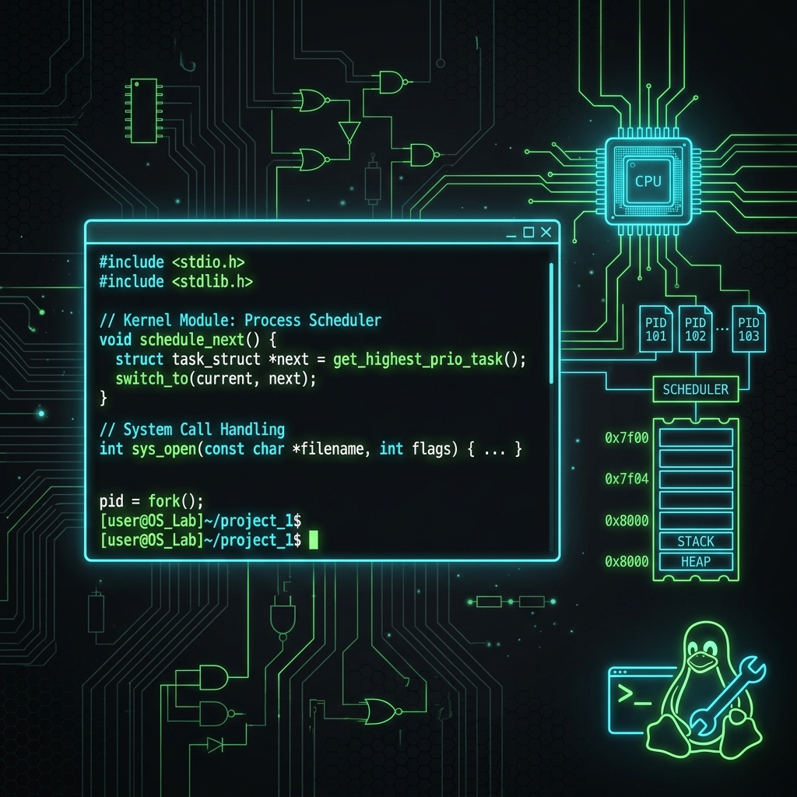

<div align="center">

# 🐧 Operating Systems Lab Manual
### A Complete Guide to OS Implementation in C



[](https://opensource.org/licenses/MIT)
[](#)
[](#)
[](#)

Master the core concepts of **Operating Systems** through hands-on C implementations. This repository covers scheduling, memory management, file systems, and more.

[Experiments](#🧪-experiments) • [How to Run](#⚙️-how-to-compile-and-run) • [Structure](#🗂️-project-structure) • [Author](#-author)

</div>

---

## 📚 Course Details
- **Subject Code**: U21CS404  
- **Course**: Operating Systems Lab  
- **Language**: C (POSIX Compliant)
- **Environment**: GCC on Linux / MacOS / WSL

---

## 🧪 Experiments

| No. | Experiment Title | Description | Key Concept |
|-----|------------------|-------------|-------------|
| 01  | **UNIX Basics** | Basics of UNIX commands & shell editors. | `Linux-CLI`, `Shell` |
| 02  | **System Calls** | Process and file-related system calls. | `fork`, `exec`, `open` |
| 03  | **CPU Scheduling** | FCFS, SJF, SRTF, Priority, & Round Robin. | `Scheduling`, `Throughput` |
| 04  | **IPC (Communication)** | Pipes and Shared Memory implementations. | `Pipes`, `Shared Memory` |
| 05  | **Producer–Consumer** | Solve synchronization using semaphores. | `Mutex`, `Semaphores` |
| 06  | **Banker's Algorithm** | Deadlock avoidance using resource logic. | `Deadlock`, `Safe Sequence` |
| 07  | **Page Replacement** | FIFO, Optimal, and LRU algorithms. | `Memory`, `Page Faults` |
| 08  | **Disk Scheduling** | FCFS, SSTF, SCAN, and C-SCAN. | `I/O Performance` |
| 09  | **File Organization** | Sequential, Random, and Serial storage. | `File Systems` |
| 10  | **File Allocation** | Sequential, Indexed, and Linked. | `Allocation Strategies` |

---

## ⚙️ How to Compile and Run

Standard GCC tools are used for all experiments.

### Clone the Repo
```bash
git clone https://github.com/ha-re-ram/OS-Lab.git
cd OS-Lab
```

### Compile & Execute
```bash
# Example: Running the FCFS scheduler
cd Experiment-03-CPU-Scheduling
gcc 03a-fcfs.c -o fcfs
./fcfs
```

---

## 🗂️ Project Structure

```text
OS-Lab/
├── Experiment-01-Basics-of-UNIX/
├── Experiment-02-System-Calls/
├── Experiment-03-CPU-Scheduling/
├── Experiment-04-IPC/
├── Experiment-05-Producer-Consumer/
├── Experiment-06-Bankers-Algorithm/
├── Experiment-07-Page-Replacement/
├── Experiment-08-Disk-Scheduling/
├── Experiment-09-File-Organization/
├── Experiment-10-File-Allocation/
├── assets/                          # Project media & banners
├── docs/                            # Documentation & Manuals
├── LICENSE                          # MIT Rights
└── README.md                        # Documentation
```

---

## 🧑‍🎓 Author

**Hareram Kushwaha**
*CSE Student at KPRIET*

[](https://www.linkedin.com/in/ha-re-ram)
[](https://github.com/ha-re-ram)

*"Exploring the foundation of computing, one system call at a time."*

---

## 📜 License
Distributed under the MIT License. See `LICENSE` for more information.

---

<div align="center">
  <b>Don't forget to star ⭐ this repository if it helped you!</b>
</div>
